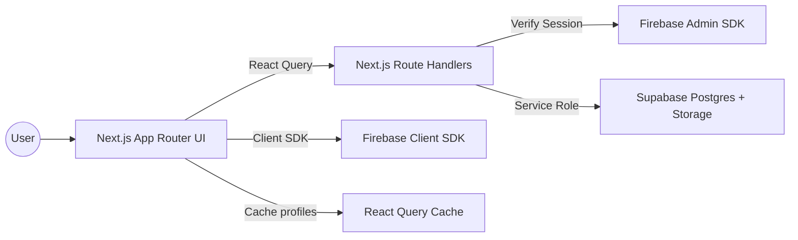
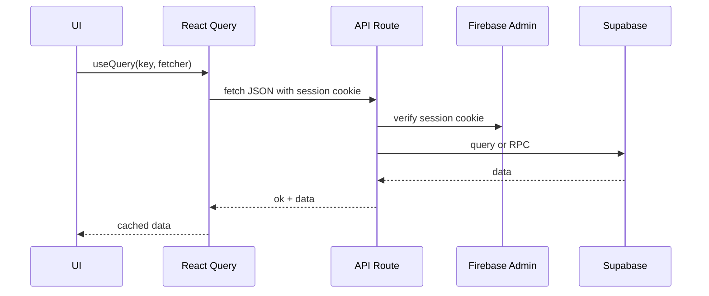
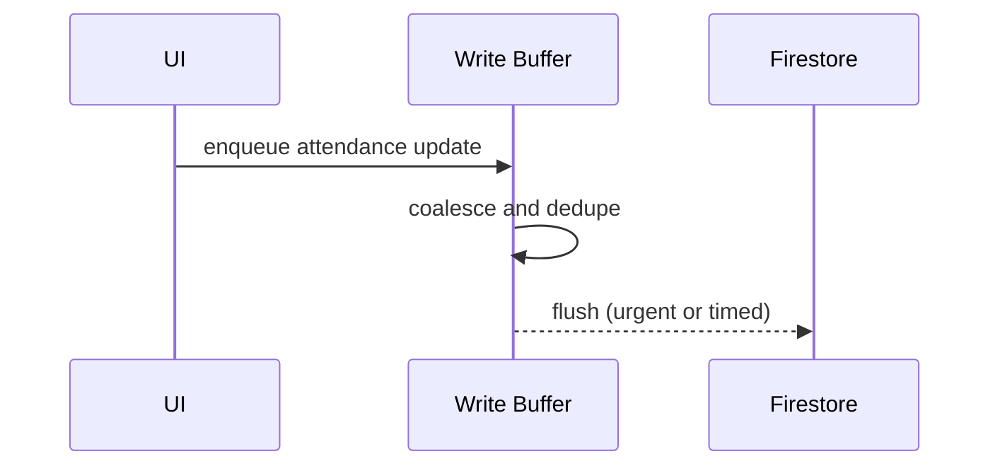
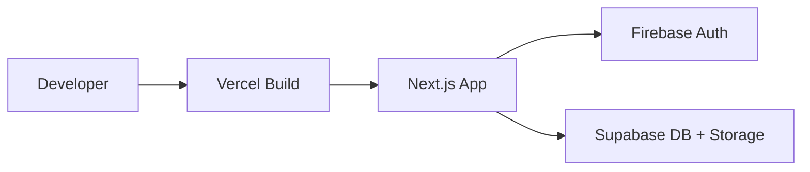

# Attendrix Web Architecture

Last reviewed: 2026-02-05

## Overview

Attendrix Web is a Next.js App Router application. The frontend uses React Query for caching, while server routes verify Firebase sessions before accessing Supabase with a service role key. User-specific API responses are explicitly `no-store` and the client provides short-lived caches to keep the UI fast and fresh.

## System Diagram

## Key Layers

- UI: Next.js pages and components in `src/app` and `src/components`.
- API: Route handlers under `src/app/api/*`.
- Auth: Firebase session cookie verified in `src/lib/auth-guard.ts`.
- Data: Supabase Postgres tables and RPC functions.
- Cache: React Query TTL profiles in `src/lib/query/cache-config.ts`.
- Write buffer: Firestore attendance updates in `src/lib/attendance/firestore-write-buffer.ts`.

## Component Hierarchy (High Level)

- Layout: `src/app/layout.tsx`, shared headers, global styles.
- Pages: `src/app/*/page.tsx` for dashboard, attendance, classes, tasks, profile.
- UI primitives: `src/components/ui/*` for buttons, cards, dialog, badges.
- Feature blocks: `src/components/dashboard/*`, `src/components/onboarding/*`, `src/components/support/*`.

## Client Data Flow

## Attendance Write Buffer

## Caching Strategy

- React Query profiles: `balanced`, `fresh`, `relaxed`.
- Short stale times for schedules and summaries.
- Long stale times for course records.
- Background revalidation and `keepPreviousData` for UI continuity.

See `CACHE_STRATEGY.md` for details.

## Error Handling

- Server returns `{ ok: true, data }` or `{ error: { code, message, details? } }`.
- `fetch-json` throws typed errors on non-OK responses.
- Client UI surfaces toasts and error states.

## Deployment Topology

## Runtime Notes

- PWA configured via `next-pwa` in `next.config.ts`.
- Service worker is disabled in development.
- Response headers include security hardening in `next.config.ts`.
