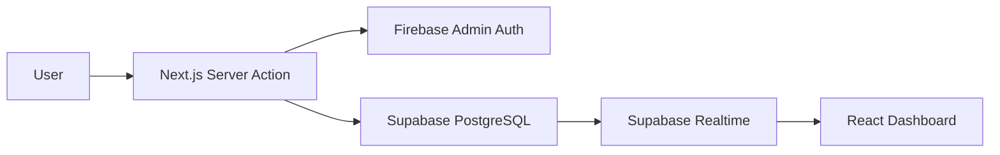

# Attendrix Landing Page

A high-performance, Neo-Brutalist academic attendance tracking platform for NIT Calicut. Built with Next.js 15, Supabase, and a custom gamification engine.

---

## 📖 Table of Contents

- [Tech Stack](#-tech-stack)
- [Key Features](#-key-features)
- [Architecture](#-architecture)
- [Prerequisites](#-prerequisites)
- [Getting Started](#-getting-started)
- [Available Scripts](#-available-scripts)
- [Deployment](#-deployment)
- [Troubleshooting](#-troubleshooting)

---

## 🛠 Tech Stack

### Frontend

- **Framework**: [Next.js 15+](https://nextjs.org/) (App Router)
- **Language**: [TypeScript](https://www.typescriptlang.org/)
- **UI Library**: [React 19](https://react.dev/)
- **Styling**: [Tailwind CSS 4](https://tailwindcss.com/)
- **Design System**: [RetroUI](https://retroui.dev/) (Neo-Brutalist, High Contrast)
- **Animations**: [GSAP](https://greensock.com/gsap/) + [framer-motion](https://www.framer.com/motion/) + [anime.js](https://animejs.com/)
- **State Management**: [TanStack Query v5](https://tanstack.com/query/latest)

### Backend & Infrastructure

- **Database / Realtime**: [Supabase](https://supabase.com/) (PostgreSQL)
- **Auth**: [Firebase Admin SDK](https://firebase.google.com/docs/admin) + [Supabase Auth](https://supabase.com/auth) (Hybrid Strategy)
- **Deployment**: [Vercel](https://vercel.com/)

---

## ✨ Key Features

- **Neo-Brutalist RetroUI**: High-contrast, accessibility-first design with bold borders and vibrant accents.
- **Precision Tracking**: Sub-minute latency for marking attendance.
- **Gamification Engine**: "Mage Rank" system with XP, levels, and streaks for academic engagement.
- **Subject Ledger**: Real-time aggregated analysis of subject-wise eligibility with "Safe Cuts" calculation.
- **Lumen AI**: Terminal-style interface for academic queries and status checks.
- **Interactive Timeline**: Visual vertical list of current and upcoming classes.

---

## 🏗 Architecture

### Directory Structure

```text
├── src/
│   ├── app/                # Next.js App Router (pages and server actions)
│   │   ├── (auth)/         # Authentication routes (signin, signup)
│   │   ├── app/            # Main application dashboard
│   │   ├── onboarding/     # Post-signup user configuration
│   │   └── api/            # Backend API endpoints
│   ├── components/
│   │   ├── sections/       # Landing page sections (Hero, Features)
│   │   ├── retroui/        # Base Neo-Brutalist components
│   │   ├── dashboard/      # Dashboard-specific UI elements
│   │   └── custom/         # Project-specific custom elements (Monitor, Terminal)
│   ├── hooks/              # Custom React hooks (queries and mutations)
│   ├── lib/                # Core logic, auth config, and utility wrappers
│   ├── schemas/            # Zod validation schemas
│   ├── types/              # TypeScript interfaces and types
│   └── utils/              # Helper functions
├── supabase/               # Supabase configuration and scripts
├── public/                 # Static assets (images, icons)
└── PRD.md                  # Product Requirements Document
```

### Authentication Flow

1. **Gatekeeper**: `middleware.ts` checks for the presence of the `__session` cookie.
2. **Hybrid Strategy**:
   - **Firebase**: Used for session management and Admin SDK features.
   - **Supabase**: Used for data persistence and Realtime updates.
3. **Session**: Secure, `httpOnly` cookies with `Lax` SameSite policy.

### Data Lifecycle



---

## 📋 Prerequisites

Before you begin, ensure you have the following installed:

- **Node.js**: 20.x or higher
- **npm**: 10.x or higher
- **Git**

You will also need:

- A **Firebase** 프로젝트 (Admin SDK private key required)
- A **Supabase** instance (URL and Anon key required)

---

## 🚀 Getting Started

### 1. Clone the repository

```bash
git clone https://github.com/sh1shank/attendrix-web.git
cd attendrix-web
```

### 2. Install dependencies

```bash
npm install
```

### 3. Environment Setup

Create a `.env.local` file in the root directory and populate it with your credentials:

```bash
cp .env.local.example .env.local
```

| Variable                          | Description                              |
| --------------------------------- | ---------------------------------------- |
| `NEXT_PUBLIC_FIREBASE_PROJECT_ID` | Your Firebase Project ID                 |
| `FIREBASE_CLIENT_EMAIL`           | Firebase Admin SDK Service Account Email |
| `FIREBASE_PRIVATE_KEY`            | Firebase Admin SDK Private Key           |
| `NEXT_PUBLIC_SUPABASE_URL`        | Your Supabase Project URL                |
| `NEXT_PUBLIC_SUPABASE_ANON_KEY`   | Your Supabase Anon/Public Key            |

### 4. Run Development Server

```bash
npm run dev
```

Open [http://localhost:3000](http://localhost:3000) to see the result.

---

## 📜 Available Scripts

| Command         | Description                                |
| --------------- | ------------------------------------------ |
| `npm run dev`   | Starts the development server with Next.js |
| `npm run build` | Compiles the production build              |
| `npm run start` | Runs the compiled production build         |
| `npm run lint`  | Runs ESLint for code quality checks        |

---

## 🌐 Deployment

### Vercel (Recommended)

This project is optimized for Vercel.

1. Push your code to a GitHub/GitLab/Bitbucket repository.
2. Connect the repository to Vercel.
3. Configure the Environment Variables in the Vercel Dashboard.
4. Deploy!

> [!IMPORTANT]
> Ensure `FIREBASE_PRIVATE_KEY` is handled as a single string (using `\n`) in Vercel environment variables.

---

## 🔍 Troubleshooting

### Next.js 15/React 19 Compatibility

This project uses the latest stable Next.js features. If you encounter dependency issues, try:

```bash
npm install --legacy-peer-deps
```

### Supabase Connection Issues

If data isn't loading, check the `supabase/check-supabase.ts` utility to verify your connection:

```bash
npx ts-node supabase/check-supabase.ts
```

### Middleware Redirect Loops

If you are stuck in a redirect loop, clear your site cookies and ensure `__session` isn't being blocked by browser extensions.

---

Built with ❤️ by NITC Students
