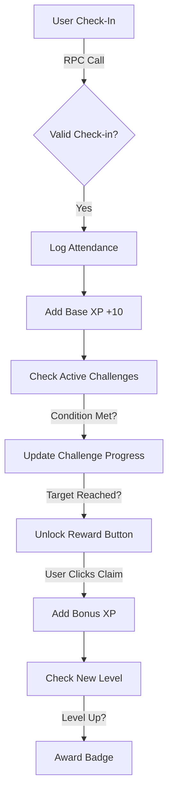

# What is Amplix?

Amplix is your **engagement meter**. It turns attendance into an **RPG**.

Instead of just logging presence, you earn **XP** for checking in, maintaining streaks, and completing weekly/monthly quests. This creates a **Quadratic Difficulty Curve** where higher levels require significantly more consistency to reach.

---

## ⚡ How It Works (The Flow)

<div className="not-prose my-8">
  <div className="flex justify-center p-6 bg-white border-2 border-black shadow-[4px_4px_0px_0px_#000]">

  </div>
</div>

---

## 🎲 Active Quests

Two types of challenges keep you engaged: **Weekly Rhythms** (consistency) and **Monthly Grinds** (endurance).

### Weekly Rhythms (Resets Monday)

| Quest Name         | Objective               | Reward |
| :----------------- | :---------------------- | :----- |
| **Busy Bee**       | Attend 10 classes       | +50 XP |
| **Full-Day Hero**  | 3x Full Attendance Days | +70 XP |
| **Speed Check-In** | Check-in within 5 mins  | +40 XP |

### Monthly Grinds

| Quest Name     | Objective                 | Reward  |
| :------------- | :------------------------ | :------ |
| **Streak God** | 20+ Day Streak            | +300 XP |
| **Iron Man**   | No Absences (15 Days)     | +200 XP |
| **Conqueror**  | Complete all Weekly tasks | +250 XP |

---

## 🏆 Path to Mastery

Your total Amplix Score determines your **Mage Rank**.

| Rank  | Title             | XP Required     |
| :---- | :---------------- | :-------------- |
| 1-3   | **Novice Mage**   | 0 - 1,000       |
| 4-6   | **Adept Caster**  | 1,001 - 5,500   |
| 7-9   | **Arcane Mage**   | 5,501 - 13,000  |
| 10-11 | **Starborn Mage** | 13,001 - 20,000 |
| 12    | **Master Mage**   | 20,000+         |

<RetroAlert type="note">
  **Master Mage** is the ultimate status symbol, achievable only by the top 1%
  of consistent attendees.
</RetroAlert>

---

## ⚠️ The Anti-Cheat Protocol

Amplix is built on trust, but verified by code.

<RetroAlert type="hazard">
**AUTOMATIC REVOCATION ACTIVE**

Amplix tracks the specific **Class IDs** used to claim challenges.

If you verify a challenge (e.g., "Attend 10 Classes") and later **delete** one of those attendance records, the system **automatically revokes** the XP reward and demotes your progress.

Do not attempt to farm XP by faking and deleting attendance.

</RetroAlert>

---

## 🛠️ Under the Hood: Backend Mechanics

The Amplix engine is powered by robust **PostgreSQL** logic running on Supabase. Here is a deep dive into the 3 core functions that drive the system.

### 1. Generating Challenges (`generate_user_challenges_v2`)

This function runs automatically to assign challenges. It ensures **idempotency** and **fairness**.

- **Time-Based Keys**: Challenges are keyed by `YYYYMM-Wxx` (Weekly) or `YYYYMM-M` (Monthly). This prevents duplicate assignments.
- **Budget-Based Selection**: To prevent inflation, the system "buys" challenges from a pool using a daily Amplix Budget.
- **Atomic Operations**: All assignments happen in a single transaction to ensure data integrity.

### 2. Evaluating Progress (`evaulate_user_challenges`)

Running on every check-in, this function is the heartbeat of the gamification engine.

- **Real-Time Calculation**: It queries your attendance logs against active active challenge conditions (e.g., `attendance_count`, `maintain_streak`).
- **Smart Reversal**: If it detects that a previously met condition is no longer true (due to a deleted attendance record), it calculates the `v_points_to_deduct` and triggers a rollback.

```sql
-- Example of the Reversal Logic Check
IF v_new_progress < v_progress."targetValue" THEN
    v_points_to_deduct := v_points_to_deduct + COALESCE(v_progress."amplixReward", 0);

    -- Log the deduction for transparency
    v_deduction_records := v_deduction_records || jsonb_build_object(
        'reason', 'Progress dropped below target'
    );
END IF;
```

### 3. Claiming Rewards (`complete_challenges_claim_reward`)

The final step where user interaction is required.

- **Double Verification**: It re-verifies `isCompleted` status before awarding points.
- **Immutable Logging**: Every point claimed is logged in `amplixLogs` with a source trace (e.g., `weekly_challenge_W04`).

<RetroAlert type="tip">
  This architecture ensures that Amplix is **Glitch-Resistant**. You can trust
  that the leaderboard accurately reflects true consistency.
</RetroAlert>
