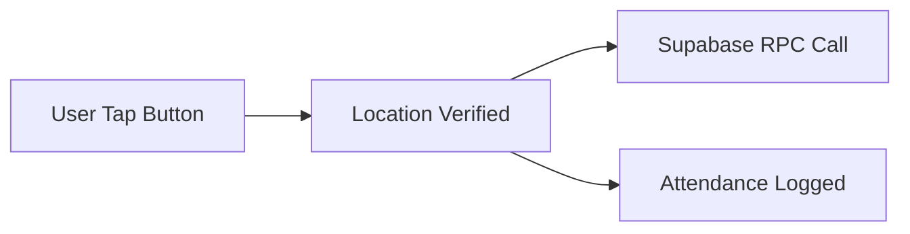

# Marking Attendance

Attendrix uses a combination of **NFC** and **Location verification** to ensure accurate, tamper-proof attendance marking.

## How It Works

When you tap "Mark Attendance" in the Attendrix app:

1. **Location Check** — Your GPS coordinates are verified against the classroom location
2. **Time Check** — The system confirms you're within the class window (±5 minutes)
3. **NFC Verification** (Optional) — If enabled, you tap the classroom NFC tag
4. **RPC Call** — A secure Supabase RPC function records your attendance

## The Verification Flow



## Location Verification

The system uses **geofencing** to verify you're in the correct building:

- **Accuracy Required**: Within 50 meters of the classroom
- **Fallback**: If GPS is unavailable, Wi-Fi SSID verification is used
- **Spoofing Protection**: Mock location apps are detected and blocked

## NFC Verification

For high-security scenarios, classrooms can have NFC tags:

- **Tag ID**: Each classroom has a unique NFC tag
- **Verification**: The tag ID must match the expected classroom
- **Fallback**: Location-only mode if NFC fails

## RPC Functions

The Supabase RPC functions handle the backend logic:

### `mark_attendance`

<CodeWindow title="mark_attendance">

```sql
-- Marks attendance for a student
SELECT mark_attendance(
  p_student_id := 'student-uuid',
  p_subject_id := 'subject-uuid',
  p_latitude := 11.3149,
  p_longitude := 75.9327
);
```

</CodeWindow>

### `get_attendance_status`

<CodeWindow title="get_attendance_status">

```sql
-- Gets current attendance percentage
SELECT get_attendance_status(
  p_student_id := 'student-uuid',
  p_subject_id := 'subject-uuid'
);
```

</CodeWindow>

## Error Handling

| Error Code          | Meaning                     | Resolution                    |
| ------------------- | --------------------------- | ----------------------------- |
| `LOCATION_MISMATCH` | You're not in the classroom | Move closer to the building   |
| `TIME_EXPIRED`      | Class window has closed     | Contact your CR               |
| `ALREADY_MARKED`    | Attendance already recorded | No action needed              |
| `NFC_INVALID`       | Wrong NFC tag scanned       | Use the correct classroom tag |

## FAQ

<FAQ>
  <FAQItem>
    **Q: What if my GPS is inaccurate?**

    A: The app uses Wi-Fi SSID as a fallback. If connected to the campus network, you're verified.

  </FAQItem>

  <FAQItem>
    **Q: Can I mark attendance from outside?**

    A: No. The geofence requires you to be within 50 meters of the classroom.

  </FAQItem>

  <FAQItem>
    **Q: What happens if I forget to mark?**

    A: Lumen AI will send you a reminder 5 minutes before the class window closes.

  </FAQItem>
</FAQ>
