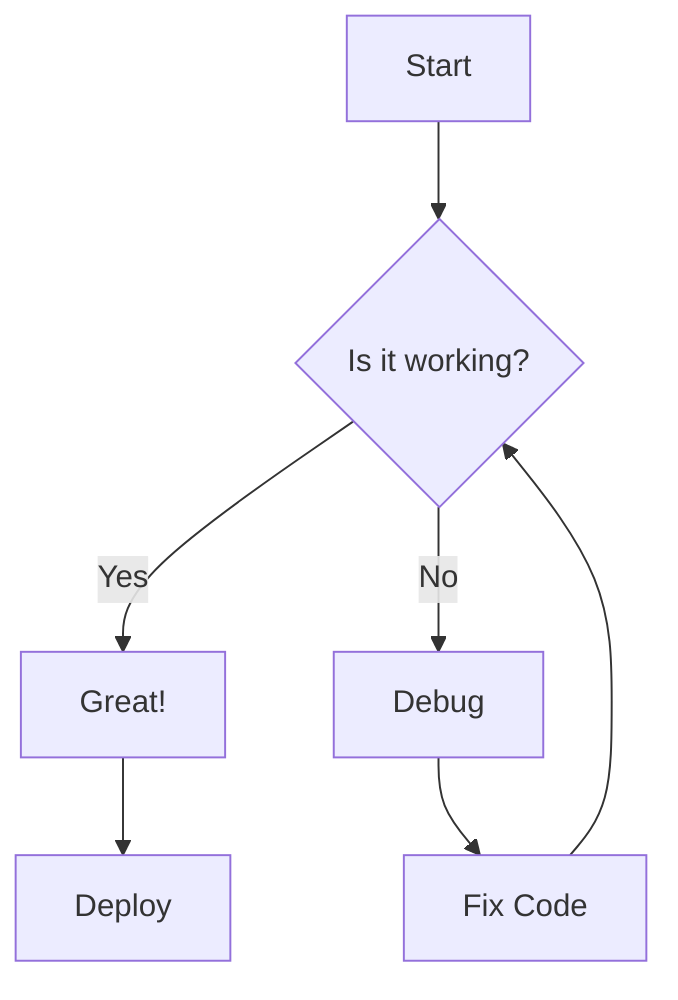

# Component Test

This page tests the new Mermaid diagrams and Retro Callouts.

## Mermaid Diagram



## Retro Callouts

> This is a default note (Blue).

> Using a warning requires custom syntax in MDX or just reliance on the component props if manually used.
> For standard blockquotes, we default to "note" style.

## Code Window

<CodeWindow title="config.ts">

```typescript
export const config = {
  theme: "retro",
  version: "1.0.0",
};
```

</CodeWindow>

## Standard Code

```typescript
console.log("This is standard code, not mermaid");
```
